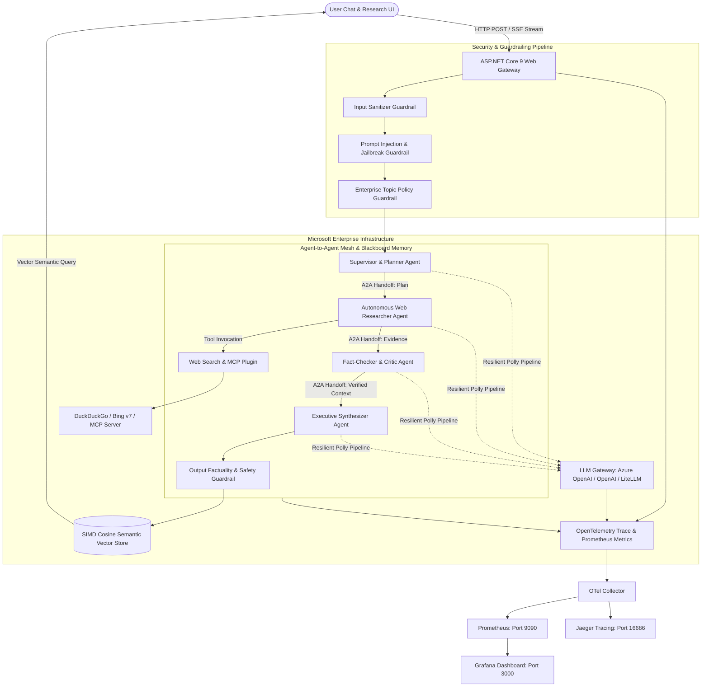

# System Architecture & Microsoft Enterprise Standards

## 1. Architectural Overview

**AgenticResearchHub** is an enterprise-grade Autonomous Multi-Agent Research Platform built on **C# 13**, **.NET 9.0**, **ASP.NET Core**, and **Microsoft Semantic Kernel**. It implements end-to-end Microsoft patterns and practices for agent orchestration, security guardrailing, OpenTelemetry observability, Model Context Protocol (MCP), and vector-based semantic knowledge indexing.

---

## 2. Microsoft Patterns & Practices Implemented

### A. Agent Orchestration Patterns
- **Supervisor / Hierarchical Decomposition**: The `SupervisorAgent` breaks down complex user inquiries into atomic, searchable sub-questions and outlines a structured execution plan.
- **Blackboard Architectural Pattern**: `AgentBlackboard` provides shared working memory across the multi-agent system, storing discovered citations, verified claims, and iterative drafts without coupling agents.
- **Plan-Act-Reflect-Synthesize Workflow**: Sequential and concurrent agent execution where evidence is searched, peer-reviewed by a critic agent, and synthesized into executive markdown.

### B. Agent-to-Agent (A2A) Communication Protocol
- Structured messaging using `AgentMessage` records with unique `MessageId`, explicit `Sender`, `Recipient` routing (or broadcast), payload `Content`, and contextual `Metadata`.
- Direct and pub-sub communication decoupled via `IA2AMessageBus` with full message trace auditability.

### C. Enterprise Guardrailing Pipeline
- **InputSanitizerGuardrail**: Trims malicious control characters, normalizes unicode, and enforces payload length limits.
- **PromptInjectionGuardrail**: Detects and mitigates jailbreaks, instruction overrides, delimiter injection, and role hijacking.
- **TopicPolicyGuardrail**: Enforces enterprise safety and scope constraints.
- **OutputFactualityGuardrail**: Ensures output completeness and catches system prompt leakage.

### D. Model Context Protocol (MCP) Support
- Implements the MCP JSON-RPC 2.0 specification for tool discovery (`tools/list`) and invocation (`tools/call`), allowing external tools to plug into the `ResearcherAgent` seamlessly.

### E. Semantic Vector Store & High-Performance Cosine Search
- Hardware-accelerated SIMD cosine similarity calculation (`Vector<float>`) for vector matching over generated intelligence reports.
- Supports dense embeddings from Azure OpenAI, OpenAI, or local deterministic high-dimensional embeddings.

### F. LLM Gateway & Polly Resilience
- Microsoft HTTP Resilience pipeline configured with:
  - Exponential backoff retry with random jitter.
  - Circuit Breaker pattern (trips on consecutive failures, self-heals after break period).
  - Configurable timeouts and rate limiting.
  - Failover to intelligent local semantic reasoner when no cloud API keys are provided.
