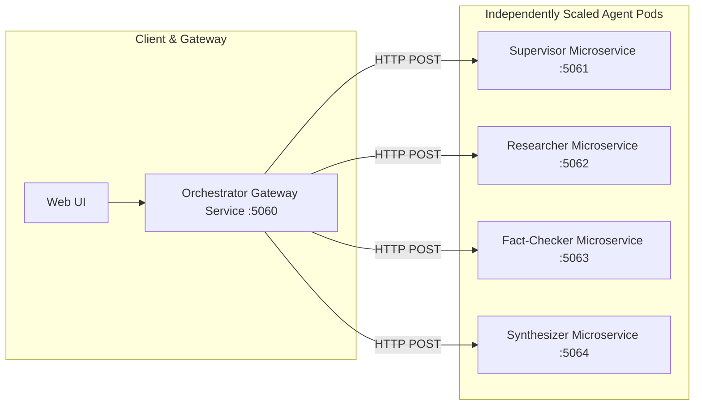

# Independently Deployable Micro-Agent Services Architecture

## 1. Overview

In **AgenticResearchHub**, agents can be deployed in two operational topologies:
1. **Consolidated High-Density Mode**: All agents and orchestration run within a single ASP.NET Core service container (ideal for rapid development, edge nodes, and cost-effective scaling).
2. **Distributed Micro-Agent Mesh Mode**: Each agent runs as an isolated, independently scalable microservice communicating via standard HTTP REST / SSE or gRPC protocols (ideal for enterprise multi-team ownership, custom GPU/CPU instance sizing, and granular horizontal pod autoscaling).



---

## 2. Microservice Agent API Contracts

Each microservice implements the unified `AgentMessage` standard:

### Supervisor Agent Microservice
- **Endpoint**: `POST /api/agents/supervisor/process`
- **Request Body**:
```json
{
  "messageId": "msg-001",
  "sender": "System",
  "recipient": "Supervisor",
  "content": "Analyze quantum computing fault tolerance in 2025",
  "timestampUtc": "2026-09-08T12:00:00Z"
}
```

### Researcher Agent Microservice
- **Endpoint**: `POST /api/agents/researcher/process`

### Fact-Checker Agent Microservice
- **Endpoint**: `POST /api/agents/factchecker/process`

### Synthesizer Agent Microservice
- **Endpoint**: `POST /api/agents/synthesizer/process`

---

## 3. Deploying the Micro-Agent Cluster

Deploy all independent microservices using Docker Compose:
```bash
docker compose -f docker-compose.microservices.yml up -d
```
